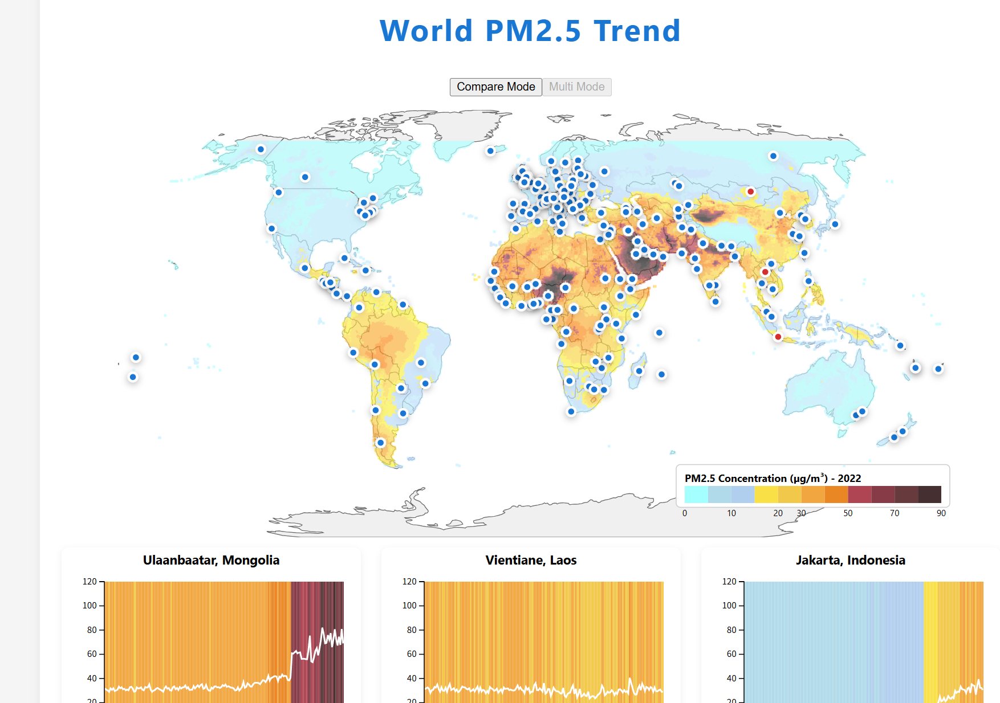

# Air Quality Dashboard

This dashboard is an extension of the Air Quality Stripes project, providing interactive visualizations and analysis tools for PM2.5 data across global cities.



## Data Sources

The dashboard utilizes data from the Air Quality Stripes project:
- `V1pt6_Cities_Data_PM2pt5.csv`: Contains historical PM2.5 data for various cities
- `concat_weighted_output.nc`: A NetCDF file containing comprehensive air quality data

## Project Structure

### Data Processing Scripts (For Reference Only)

The following Python scripts were used to process the data. These scripts are provided for reference purposes only, as the processed data is already included in the project.

1. `extract_pm25_2022.py`
   - Extracts and processes PM2.5 data for the year 2022
   - Updates the dataset with the latest available information
   - Ensures data consistency and handles missing values

2. `generate_cities_with_coords_new.py`
   - Generates a JSON file containing city coordinates
   - Maps cities from the PM2.5 dataset to their geographical coordinates
   - Uses the `worldcities.csv` database for accurate location data
   - Output: `cities_with_coords.json` for map visualization

3. `check_data_structure.py`
   - Validates data structure and integrity
   - Performs quality checks on the input data
   - Ensures compatibility with the visualization components

### Web Dashboard Implementation

The dashboard is built using React and includes several key components:

#### Core Components

- `App.js`: Main application component and routing
- `Map.js`: Interactive world map visualization using GeoJSON
- `PM25Canvas.js`: PM2.5 data visualization canvas
- `MultiTrendCharts.js` & `TrendChart.js`: Time series trend visualization
- `ColorLegend.js`: Color scale legend for PM2.5 levels
- `ErrorBoundary.js`: Error handling component

#### Key Features

1. **Interactive World Map**
   - Displays global PM2.5 data distribution
   - City-level data points with color-coded indicators
   - Zoom and pan capabilities

2. **Time Series Visualization**
   - Historical PM2.5 trends for selected cities
   - Color-coded stripes indicating pollution levels
   - Interactive timeline navigation

3. **Data Analysis Tools**
   - Statistical analysis of PM2.5 trends
   - City comparison capabilities
   - Data export functionality

## Technical Stack

- **Frontend**: React.js
- **Data Visualization**: D3.js, Mapbox GL
- **Styling**: CSS Modules

## Starting the Dashboard

```bash
# Install dependencies
cd Dashboard
npm install

# Start the development server
npm start
```

The dashboard will be available at `http://localhost:3000` by default.

## Browser Compatibility

The dashboard is optimized for modern browsers:
- Chrome (recommended)
- Firefox
- Safari
- Edge 