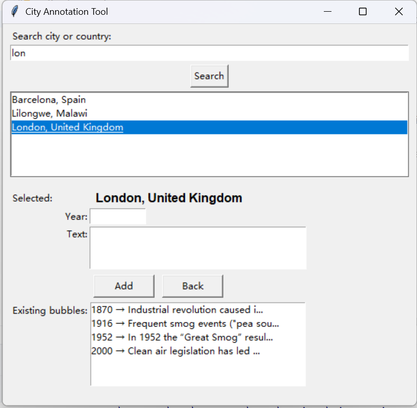
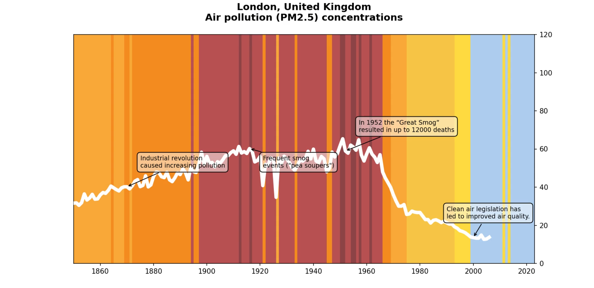

# Air Quality Animation Tool

This tool is designed to create animated visualizations of historical PM2.5 data for cities worldwide, with the ability to add annotated explanations at key points in time.





## Project Structure

- `cities_json/`: Directory containing JSON files for each city with PM2.5 data and annotations
- `V1pt6_Cities_Data_PM2pt5.csv`: Source data file from Air Quality Stripes project
- `split_cities.py`: Data processing script (for reference only, no need to run)
- `annotate_cities.py`: GUI tool for adding annotations to city data
- `mp4_with_bubbles.py`: Animation generator for creating MP4 visualizations

## Main Components

### 1. City Annotation Tool (`annotate_cities.py`)

A graphical interface for managing annotations for each city's PM2.5 data visualization.

**Features:**
- Search and select cities
- Add, edit, and delete annotations for specific years
- Preview existing annotations
- Automatically calculate optimal annotation bubble positions
- Save annotations directly to city's JSON file

**Usage:**
```bash
python annotate_cities.py
```

**Steps:**
1. Search for a city using the search box
2. Select the city from the results list
3. Enter the year and annotation text
4. Click "Add" to create a new annotation
5. Use "Update" or "Delete" to modify existing annotations
6. Annotations are automatically saved to the city's JSON file

### 2. Animation Generator (`mp4_with_bubbles.py`)

Creates animated visualizations showing PM2.5 trends with annotated explanations.

**Features:**
- Dynamic PM2.5 trend line
- Color-coded background indicating pollution levels
- Animated appearance of annotation bubbles
- High-quality MP4 output

**Usage:**
1. Open `mp4_with_bubbles.py`
2. Modify the target city:
```python
# ====== 2) Specify the target city ======
target_city = "London, United Kingdom"  # Change this to the desired city
```
3. Run the script:
```bash
python mp4_with_bubbles.py
```

**Important Notes:**
- Only one city can be processed at a time
- The output video will be saved in the current directory
- The city name must match exactly as it appears in the JSON files
- Make sure the city has annotations added through the annotation tool first

## Workflow

1. **Add Annotations**
   - Run `annotate_cities.py`
   - Select a city and add annotations for significant years
   - Save the annotations

2. **Generate Animation**
   - Edit `mp4_with_bubbles.py` to set the target city
   - Run the script to generate the MP4 file
   - The animation will be saved as `{city_name}_{country}.mp4`

3. **Repeat for Other Cities**
   - Change the target city in `mp4_with_bubbles.py`
   - Run again to generate animations for other cities

## Output Format

The generated animations include:
- A white trend line showing PM2.5 concentration over time
- Color-coded background indicating pollution severity
- Annotation bubbles that appear at their designated years
- City name and title in the header
- Professional-looking transitions and animations

## Data Source

The PM2.5 data comes from the Air Quality Stripes project's `V1pt6_Cities_Data_PM2pt5.csv` file, which contains historical PM2.5 measurements for cities worldwide. 