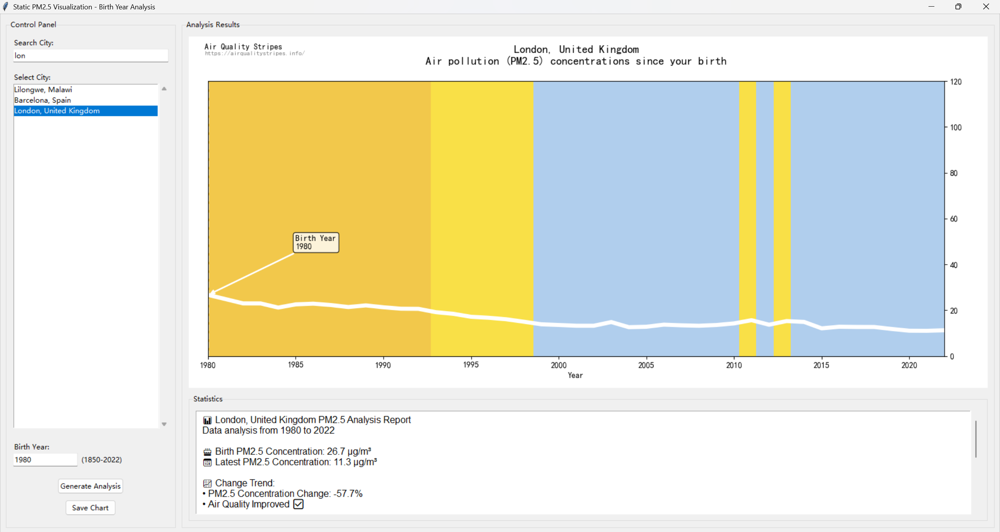

# Air Quality Static Visualization Tool

This tool is part of the Air Quality Stripes project extension, providing an interactive interface for analyzing PM2.5 data and generating static visualizations with birth year analysis.



## Data Sources

The tool uses data from the Air Quality Stripes project:
- `V1pt6_Cities_Data_PM2pt5.csv`: Contains historical PM2.5 data for various cities

## Main Application (`static_pm25_visualizer.py`)

A GUI application built with Python and Tkinter that provides:

### Key Features
- Interactive city search and selection
- Birth year-based PM2.5 analysis
- Customized visualization generation
- Detailed statistical analysis including:
  - PM2.5 concentration trends
  - Years of life lost estimation
  - WHO standard comparisons
  - Change percentage calculations

### Technical Implementation
- Built with Python Tkinter for the GUI
- Uses Matplotlib for visualization
- Custom color mapping for PM2.5 levels
- Statistical analysis functions
- Data validation and error handling

## How to Run

1. Ensure you have Python installed with required packages:
   ```
   pip install pandas numpy matplotlib
   ```

2. Run the visualization tool:
   ```
   python static_pm25_visualizer.py
   ```

## Output

The tool generates:
- Interactive PM2.5 visualization charts
- Statistical analysis reports
- Exportable PNG images of the visualizations

Charts are saved in the current directory with the naming format:
`CityName_BirthYear_to_2022.png` 